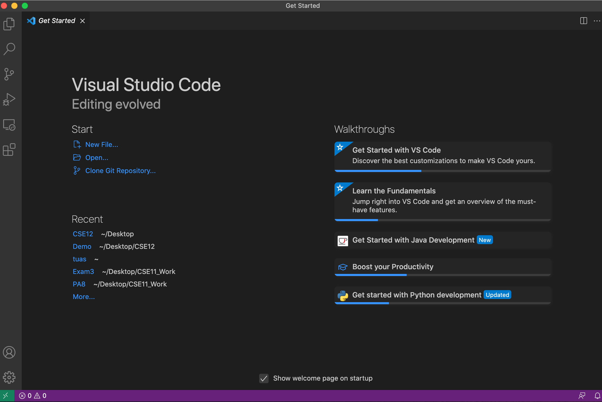
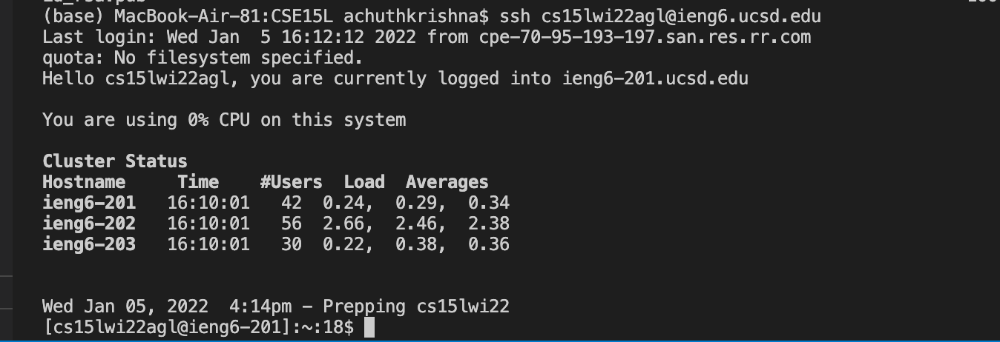
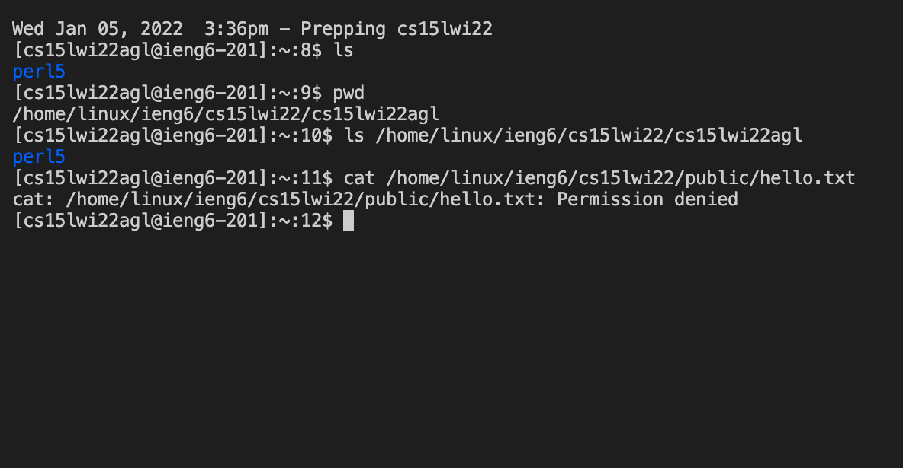
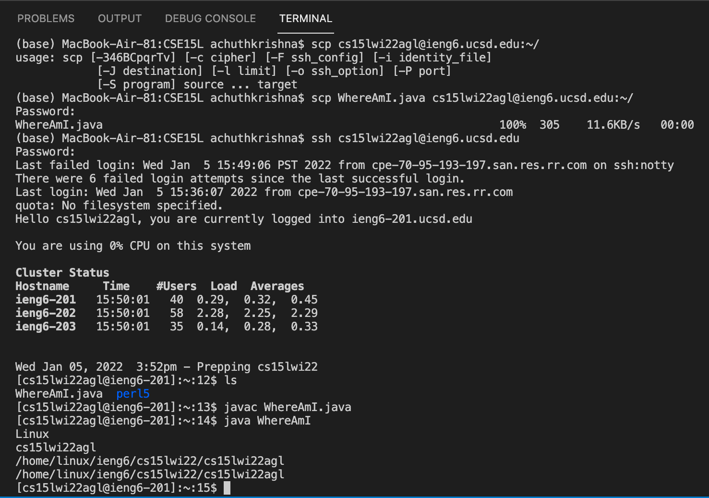
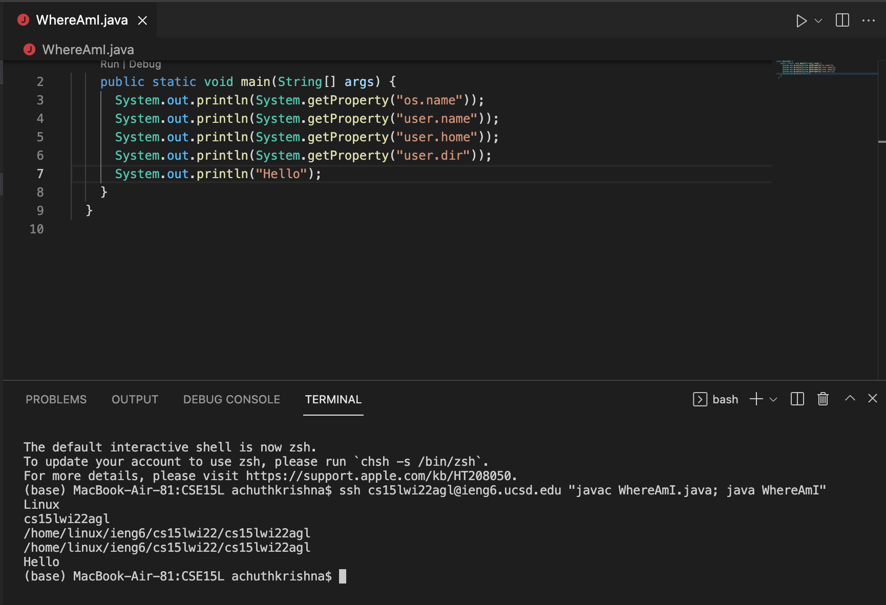

# Lab Report 1
## Logging into a course-specific account on UCSD ieng6 servers
---
**Step 1: Installing VSCode**

- Go to the VSCode website linked [here](https://code.visualstudio.com/)
- Follow all the installation instructions for your OS
- Upon successful installation, open VSCode. You should see something like this:

**Step 2: Remotely Connecting**

If on a Windows device, first install OpenSSH [here](https://docs.microsoft.com/en-us/windows-server/administration/openssh/openssh_install_firstuse) and then proceed.

- Look up your course account [here](https://sdacs.ucsd.edu/~icc/index.php)
- Open a terminal and type:
`ssh (account name)@ieng6.ucsd.edu` at the prompt
- Enter your password when prompted, and continue. Once logged in, your terminal should look similar to this:

**Step 3: Trying Commands**

- Try various commands such as `ls`, `pwd`, and `cd` like so:

**Step 4: Moving Files with `scp`**

- You can move files from the client to the server with the `scp` command: 
type `scp (file_name) (account name)@ieng6.ucsd.edu:~/` in the terminal
- Enter your ssh password at the prompt
- Upon logging into the server, you should find your file in the home directory, as pictured below:

**Step 5: Setting Up an SSH Key**

- On the client computer, type `ssh keygen` in the terminal
- Enter the file where the key should be saved, or keep the default file path
- Leave the password field blank to avoid entering a password for future logins 

(Windows users must follow the additional directions found [here](https://docs.microsoft.com/en-us/windows-server/administration/openssh/openssh_keymanagement#user-key-generation)).
Next, `ssh` into the server and execute the following actions:

- Make a new .ssh directory with: `mkdir .ssh`
- Log out of the server and move the public key to the server's newly created `.ssh` directory with the following command:

`scp (file path used to store public key) (account name)@ieng6.ucsd.edu:~/.ssh/authorized_keys`

You may then log in to the server without a password like so:

**Step 6: Optimizing Remote Running**

To optimize running commands and files remotely, you may chain commands together.

- Using quotations around commands will run them on the server. For example, the command `ssh (account name)@ieng6.ucsd.edu "ls"` will log you into the server and list the directories present
- Using semicolons allows you to run multiple commands at the same time

Below is an example of optimizing the copying, compiling, and running of the Java file `WhereAmI.java`:

