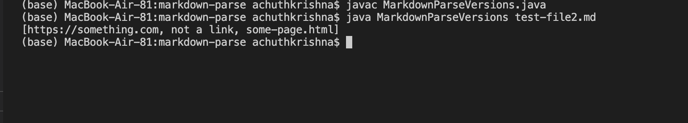
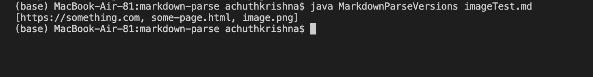
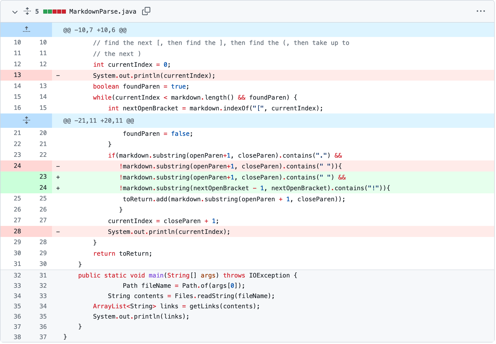
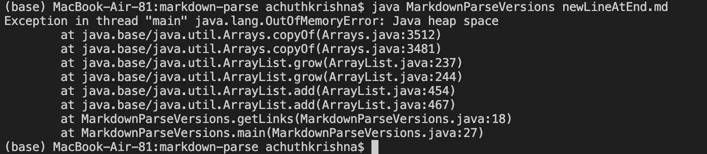
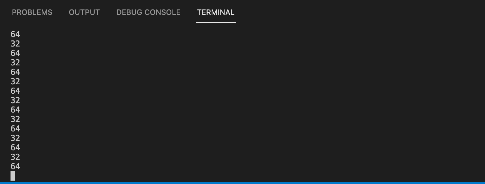
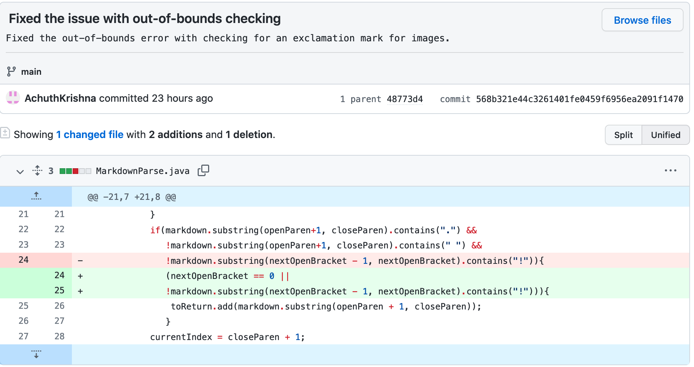

# Lab Report 2
## Testing and Debugging
---
**First Change:**
This change was made in response to the following error message from [this failure-inducing markdown file](https://github.com/AchuthKrishna/markdown-parse/blob/d4926b7f1042275372910d358593c70c443af221/test-file2.md):

The changes made to fix this issue are as shown:

**Second Change:**
This change was made in response to the following error message from [this failure-inducing markdown file with an image](https://github.com/AchuthKrishna/markdown-parse/blob/30921ad68e84ae6b1d1913820656cff57dd38f8c/imageTest.md):

This symptom, where an image is printed as if it were a link, seems to be indicative of a bug; namely, we are treating all items with a "." wrapped in parentheses following brackets as links. Images, however, are different.
The changes made to fix this issue are as shown:

This fix looks for an exclamation mark before the brackets, as an exclamation mark before brackets in markdown files is indicative of an image. If the exclamation mark exists, we do not add the item to our list of links.

**Third Change:**
This change was made in response to the following error message from [this failure-inducing markdown file with a new line](https://github.com/AchuthKrishna/markdown-parse/blob/30921ad68e84ae6b1d1913820656cff57dd38f8c/newLineAtEnd.md):

At first, it is not apparent what the error exactly is. Adding print statements to print out the indices being accessed
by the code makes things more clear, as shown:

Here, we can see that the indices are alternating between increasing and decreasing, thus causing an infinite loop.
The changes made to fix this are as shown:

This fix involves checking for the existence of any more open parentheses in the rest of the file. If no more parentheses are found, a boolean flag is set to false. Since the while loop is now changed to only run when the boolean flag is true, we avoid the issue of infinitely looping with files that have a new line at the end.
