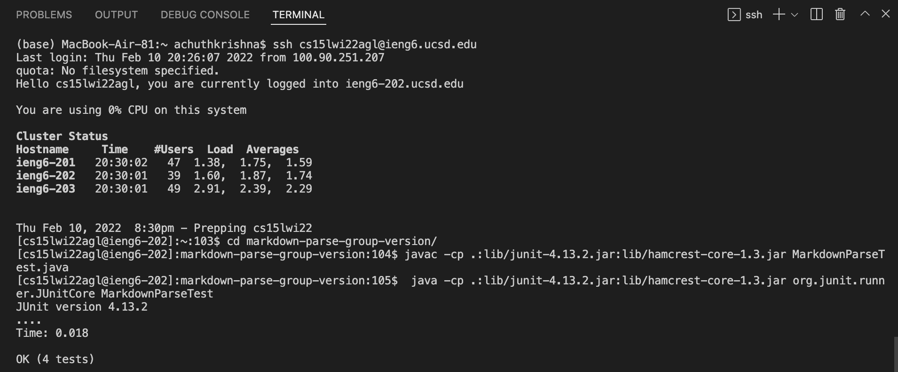

# Lab Report 3
## Copying Whole Directories
---
**Step One:**

Using scp -r, we can copy an entire GitHub directory to the ieng6 servers. The command and output is as shown:

**Step Two:**

After copying the directory, we can ssh into ieng6 and run our tests using `javac` and `java` as shown:

