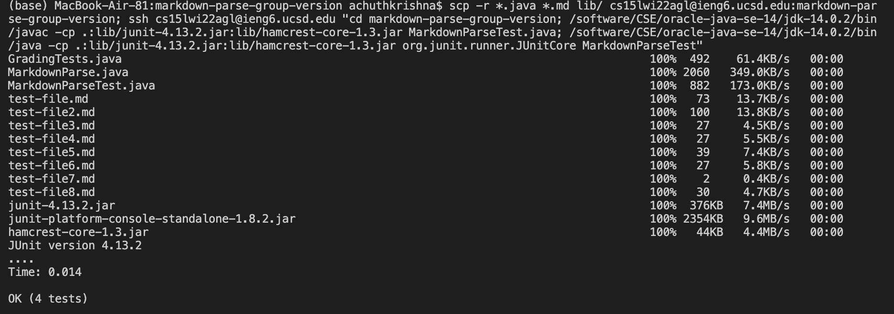

# Lab Report 3
## Copying Whole Directories
---
**Step One:**

Using scp -r, we can copy an entire GitHub directory to the ieng6 servers. The command and output is as shown:

**Step Two:**

After copying the directory, we can ssh into ieng6 and run our tests using `javac` and `java` as shown:

**Step Three:**

However, this process can be slow and time consuming. We can instead combine these two processes into one command, as shown below:

This allows us to run all of the processes on one line. This particular command is longer solely due to the incompatibility in Java versions and path setups between the local machine and the ieng6 servers. 
