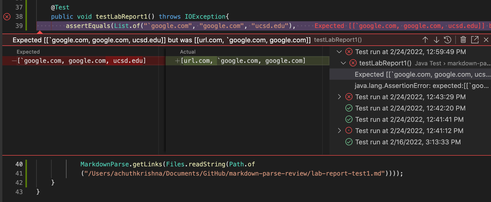
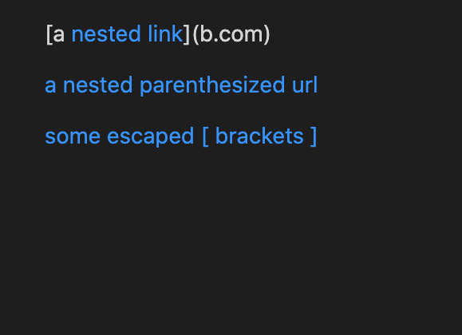
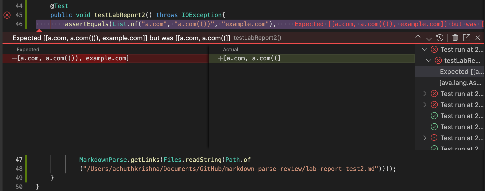

# Lab Report 4
## Code Review
---
Link to [my markdownparse repository](https://github.com/AchuthKrishna/markdown-parse-group-version)

Link to [the reviewed markdownparse repository](https://github.com/yi113/markdown-parse)

**NOTE: As the reviewed repository is someone else's, I did not commit and push the tests/test files to that repository**

**Test One:**

The first markdown snippet should look like this:

We can see that `google.com, google.com, and ucsd.edu should be printed as links, while url.com should not.
Below is the test for the first markdown snippet:

**My Implementation:**

Testing snippet 1 with my implementation yields the following failed test:

Here, url.com is printed as a link when it should not be.

**Reviewed Implementation:**

Testing snippet 1 with the other person's implementation yields the following failed test:

Here, url.com is printed as a link when it should not be, and ucsd.edu is not printed as a link.

**Test Two:**

The second markdown snippet should look like this:

We can see that a.com, a.com(()), and example.com should be printed as links, while b.com should not.
The test for this snippet is shown below:

**My Implementation:**

Testing snippet 2 with my implementation yields the following failed test:

Here, the last two parentheses are not included in the name of the link a.com(()).

**Reviewed Implementation:**

Testing snippet 2 with the other person's implementation yields the following failed test:

Here, the last two parentheses in a.com(()) are not included in the name of the link, and example.com is not recognized as a link.

**Test Three:**

The third markdown snippet should look like this:

We can see that only https://ucsd-cse15l-w22.github.io/ should be printed as a link, while the others should not.
The test for this snippet is shown below:

**My Implementation:**

Testing snippet 3 with my implementation yields the following failed test:

Here, the link https://ucsd-cse15l-w22.github.io/ is not printed, and the rest of the file is instead recognized as a link.

**Reviewed Implementation:**

Testing snippet 3 with the other person's implementation yields the following failed test:

Here, the same error occurs where https://ucsd-cse15l-w22.github.io/ is not printed, and the rest of the file is recognized as a link when it should not be.

**Code Change One:**

For snippet 1, I believe a fairly quick fix is possible for my markdownparse program. The fix would involve looking for any backticks in pairs, 
and moving the current index past the second backtick. This would keep url.com from being printed as a link.

**Code Change Two:**

For snippet 2, a change could be implemented wherein we first search for pairs of brackets and parentheses. This way,
we can use the outermost pair of parentheses in identifying a link name, meaning that the last two parentheses in a.com(()) would not be cut off.

**Code Change Three:**

For snippet 3, a more involved change could be necessary. This is because multiple factors are likely at play in causing such a massive error. 
First, the String trim() method likely should be used on elements inside parentheses to avoid space errors. Second, we need to find a way to search for line breaks
and not add a link if a line break exists within the brackets before it. Third, there needs to be a way to check for the existence of closing brackets and closing
parentheses that are paired with open parentheses. If no closing bracket/parenthesis exists, the link should not be added as a link.
