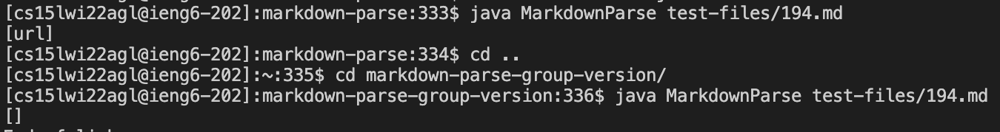

# Lab Report 5
## Code Differences
---

The two tests where our implementation differed from the class implementations are shown below. The first output
in each image is the class implementation output, whereas the second output in each image is our implementation's output.

Test file 22.md:

Test file 194.md:

To find these different results, we successfully used `diff` to print out the outputs that were different between the two 
implementations. However, to find the exact markdown files where the differences occurred, 
we had to look at the line number indicated by the output, as the file name was not printed.

As can be seen, the differences between the tests lies in the class implementation not identifying any links,
and our implementation identifying at least one item as a link in that test file. The correct outputs should correspond
to the following markdown previews:

Test file 22.md:

Test file 194.md:

In the first test case (22.md), we see that the expected output is exactly one link. Therefore, our implementation is correct 
and the class implementation is incorrect for this markdown test case. The bug with the class implementation that 
leads to this symptom lies in the following code block:

Test file 22.md:

Since the link has a space in it, the class implementation does not add it to the ArrayList of links, and
returns an empty ArrayList.

In the second test case (194.md), we see that the expected output is also one link. Therefore, our implementation is incorrect. However,
while the class implementation does print a link, that link is incomplete, so it is also incorrect for this markdown test case. 
The bug with our implementation that leads to this symptom lies in the following code block:

Test file 194.md:

Here, we can see that the program checks if the closing bracket is just before the opening parenthesis before adding the contents
within the parentheses as a link. Since there are characters between the closing bracket and opening parenthesis, our program
skips over the link and prints an empty ArrayList.
